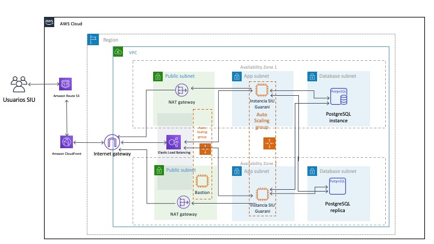

# Arquitectura de referencia de SIU Guarani en AWS 
## EN DESARROLLO

### Versión 1.0.0 

---

© 2020 Amazon Web Services, Inc. y sus filiales. Todos los derechos reservados. Esta obra no puede ser reproducida o redistribuida, en su totalidad o en parte, sin el permiso previo por escrito de Amazon Web Services, Inc. Se prohíbe la copia comercial, préstamo o venta.

¿Errores o correcciones? Envíenos un correo electrónico a [mboaglio@amazon.com](mailto:mboaglio@amazon.com).

---

## Descripción general

Esta arquitectura de referencia proporciona un conjunto de plantillas YAML que ayudan a impementar un entorno [SIU Guarani](https://www.siu.edu.ar/siu-guarani) con alta disponibilidad, elástico y escalable en AWS. 

A su vez, SIU Guaraní registra las actividades de la gestión académica dentro de las universidades desde que un alumno se inscribe hasta que egresa. El objetivo de SIU Guaraní es la administración de las tareas académicas en forma óptima y segura, con la finalidad de obtener información consistente para los niveles operativos y directivos. Para mas información: [SIU Guarani](https://www.siu.edu.ar/siu-guarani)

La aquitectura se implementa mediante el uso de [Amazon Virtual Private Cloud (Amazon VPC)](http://docs.aws.amazon.com/AmazonVPC/latest/UserGuide/VPC_Introduction.html), [Amazon Elastic Compute Cloud (Amazon EC2)](http://docs.aws.amazon.com/AWSEC2/latest/UserGuide/concepts.html), [Scaling Auto aws.amazon.com/autoscaling/latest/userguide/WhatIsAutoScaling.html), [Elastic Load Balancing (Application Load Balancer)](http://docs.aws.amazon.com/elasticbalancing/latest/application/introduction.html), [Amazon Relational Database Service (Amazon RDS)](http://docs.aws.amazon.com/AmazonRDS/latest/UserGuide/Welcome.html), [Amazon CloudFront](http://docs.aws.amazon.com/AmazonCloudFront/latest/DeveloperGuide/Introduction.html), [Amazon CloudFront](http://docs.aws.amazon.com/AmazonCloudFront/latest/DeveloperGuide/Introduction.html), [Amazon CloudFront](http://amazon.aws.amazon.com/AmazonCloudFront/latest/DeveloperGuide/Introduction.html), [Amazon CloudFront](http://docs.amazon.amazon.com/Amazon Route 53](http://docs.aws.amazon.com/Route53/latest/DeveloperGuide/Welcome.html), [Amazon Certificate Manager (Amazon ACM)](http://docs.aws.amazon.com/acm/latest/userguide/acm-overview.html) con [AWS CloudFormation](http://docs.aws.amazon.com/AWSCloudFormation/latest/UserGuide/Welcome.html). 

Esta arquitectura puede ser excesiva para muchas implementaciones de SIU-Guarani, sin embargo, las plantillas se pueden ejecutar individualmente o modificar para implementar un subconjunto de la arquitectura que se adapte a sus necesidades. Para este punto se recomienda como mínimo implementar las todas las plantillas hasta el load balanc er (VPC, Security Groups, Bastion Host y Public ALB). De esta forma se puede implementar una arquitectura preparada para crecer lista para cuando llegue el momento.

## Instalación simple

Si desea implementar el sistema SIU Guarani en forma rapida, siga estos pasos. Puede leer los detalles despues para comprender mejor la arquitectura.

1) Si tiene previsto utilizar TLS, debe crear o importar su certificado en Amazon Certificate Manager antes de lanzar SIU-Guarani.
2) Instale el stack de Cloud Formation aws-refarch-siuguarani-00-master.yaml (TODO)
3) Una vez finalizada la instalación del stack, vaya al sitio web para completar la configuración de SIU-Guarani.

Puede lanzar este stack de CloudFormation, con su cuenta, en las siguientes regiones de AWS. 

| Codigo de region AWS | Nombre | Launch |
| --- | --- | --- 
| us-east-1 |US East (N. Virginia)|  |
| sa-east-1 |San Pablo (Brasil)|  |

## Instalación detallada

Haga el deploy de los templates que se encuantran en la carpeta "templates". Uno por uno, en el orden en el que estan numerados, y completando la información que se solicita en cada uno.
Preste atención a que muchos de los parámetros que se piden en un template son datos de output o parámetros de otros templates.
La forma mas simple de realizar el deploy es bajar los archivos yaml a una carpeta local, e iniciar el deploy de cada uno desde la consola de Cloud Formation (opción "Create Stack with new resources" -> "Upload a template file").

## Arquitectura

En las secciones siguientes se describen los componentes individuales de la arquitectura. Esta arquitectura toma varias cosas de la [Arquitectura de Referencia de WordPress](https://github.com/awslabs/aws-refarch-wordpress). Puede consultarla en forma adicional para tomar ideas de mejoras. 

### Detalle de templates YAML

#### aws-refarch-siuguarani-00-master.yaml (TODO)
Template general que permite hacer una instalación completa de la arquitectura de referencia.

#### aws-refarch-siuguarani-01-newvpc.yaml
Arma el VPC 

#### aws-refarch-siuguarani-02-securitygroups.yaml
Security Groups

#### aws-refarch-siuguarani-03-bastion.yaml
Arma el Bastion Host y su grupo de autoscaling

#### aws-refarch-siuguarani-04-publicalb.yaml
Arma el Load Balancer Publico

#### aws-refarch-siuguarani-05-rds-cluster-aurora-postgres.yaml (TODO)
Arma un Cluster de Amazon RDS Aurora Postgres 9.6. Si se utiliza este template, no se debe utilizar el aws-refarch-siuguarani-05-rds-postgres.yaml ya que ambos crean la base de datos. Se debe definir uno de los dos. 

#### aws-refarch-siuguarani-05-rds-postgres.yaml (TODO)
Arma el Amazon RDS Postgres 9.6. Si se utiliza este template, no se debe utilizar el aws-refarch-siuguarani-05-rds-cluster-aurora-postgres.yaml ya que ambos crean la base de datos. Se debe definir uno de los dos.

#### aws-refarch-siuguarani-06-cloudfront.yaml
Arma la distribución de CloudFront

#### aws-refarch-siuguarani-08-web.yaml (TODO)
Arma el primer web server del front end. Se conecta al SVN y baja el codigo de SIU
Arma el grupo de autoscaling

#### aws-refarch-siuguarani-09-route53.yaml
Arma el DNS usando Amazon Route53

#### aws-refarch-siuguarani-10-dashboard.yaml (TODO)
Arma el Dashboard de monitoreo de la solución completa

## Servicios AWS utilizados en la arquitectura

### Administrador de certificados de AWS

AWS Certificate Manager es un servicio que le permite aprovisionar, administrar e implementar fácilmente certificados SSL/TLS (Secure Sockets Layer/Transport Layer Security) para su uso con los servicios de AWS. Debe ejecutar SSL/TLS para proteger sesiones y contraseñas. Si tiene previsto utilizar Transport Layer Security (TLS), debe crear o importar un certificado TLS en AWS Certificate Manager antes de lanzar la plantilla. Además, si utiliza CloudFront y aloja SIU-Guarani en una región distinta de us-east-1, debe crear o importar el certificado tanto en us-east-1 como en la región en la que hospeda SIU-Guarani. CloudFront siempre utiliza certificados de us-east-1.

### Balanceador de carga de aplicaciones

Un Balanceador de carga de aplicaciones distribuye el tráfico de aplicaciones entrantes entre varias instancias EC2 en varias zonas de disponibilidad. Para lograr una alta disponibilidad, puede agrupar varios servidores SIU-Guarani detrás de un equilibrador de carga.  

### Autoescalado de Amazon

Amazon EC2 Auto Scaling le ayuda a asegurarse de que tiene el número correcto de instancias Amazon EC2 disponibles para gestionar la carga de la aplicación. La plantilla configura el escalado automático en función de la utilización de la CPU. Se agrega una instancia adicional cuando la utilización media de la CPU supera el 75% durante tres minutos y se quita cuando la utilización media de la CPU es inferior al 25 % durante tres minutos. Según el tipo de instancia que esté ejecutando, la configuración de caché que elija y otros factores, es posible que otra métrica sea un mejor predictor de carga. Siéntase libre de cambiar las métricas según sea necesario.

*Tenga en cuenta que el asistente de instalación provoca picos en la CPU que podrían hacer que el clúster se escale inesperadamente. Inicialmente, debe implementar un único servidor estableciendo el tamaño min y máximo de ASG en uno. A continuación, complete el asistente de configuración de SIU-Guarani y actualice la pila de CloudFormation estableciendo el tamaño min y max de ASG a los límites deseados.*

#### Amazon CloudFront

Amazon CloudFront es un servicio de red de entrega de contenido global (CDN) que ofrece de forma segura datos, vídeos, aplicaciones y API a sus espectadores con baja latencia y altas velocidades de transferencia. Opcionalmente, la plantilla puede configurar CloudFront para almacenar en caché contenido más cercano a los usuarios. Esto es especialmente beneficioso si los usuarios están repartidos en un área geográfica grande. Por ejemplo, estudiantes remotos en un programa en línea.

### Amazon Route 53 (DNS)

Amazon Route 53 es un servicio web de sistema de nombres de dominio (DNS) en la nube (DNS) de alta disponibilidad y escalable. Opcionalmente, la plantilla configurará un alias de Route53 que apunte al Balanceador de carga de aplicaciones o A CloudFront. Si utiliza otro sistema DNS, debe crear un registro CNAME en su sistema DNS para hacer referencia al Balanceador de carga de aplicaciones o A CloudFront (si está implementado). Si no tiene acceso a DNS, puede dejar Nombre de dominio en blanco y la plantilla configurará Moodle para que use el nombre de dominio de Application Load Balancer generado automáticamente.

## Licencia

Este codigo está licenciado bajo la licencia MIT-0

Consulte la licencia para conocer los términos aplicables.
